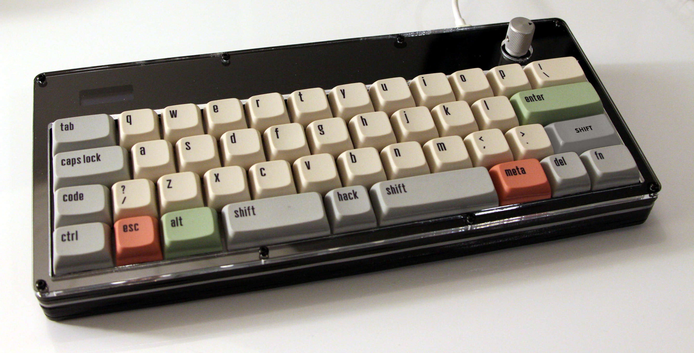

# Squash Keyboard Hardware

Small keyboard for big brains with lots of layers
🤏 ⌨️ 🧠 🍰

This keyboard uses an acrylic case, POM switch-plate, and PCB mounted switches and stabilizers.

See Squash's bigger brother for [build instructions](https://github.com/KoBussLLC/grabert-hardware/blob/main/doc/BUILDGUIDE.md) and [additional information](https://github.com/KoBussLLC/grabert-hardware/blob/main/README.md).

## Layout

[Keyboard Layout Editor Permalink](http://www.keyboard-layout-editor.com/##@@_x:2.75&w:1.5%3B&=0,0&=0,1&=0,2&=0,3&=0,4&=0,5&=0,6&=0,7&=0,8&=0,9&=0,10&_w:1.5%3B&=0,11%3B&@_x:2.75&w:1.75%3B&=1,0&=1,1&=1,2&=1,3&=1,4&=1,5&=1,6&=1,7&=1,8&=1,9&_w:2.25%3B&=1,10%3B&@_x:0.25&w:1.25%3B&=2,0%0A%0A%0A0,1&=2,1%0A%0A%0A0,1&_x:0.25&w:2.25%3B&=2,0%0A%0A%0A0,0&=2,2&=2,3&=2,4&=2,5&=2,6&=2,7&=2,8&=2,9&=2,10&_w:1.75%3B&=2,11%3B&@_x:2.75&c=%23AAAAAA&w:1.25%3B&=3,0&=3,1&=3,2%0A%0A%0A1,0&_c=%23cccccc&w:6.25%3B&=3,4%0A%0A%0A1,0&_c=%23AAAAAA&w:1.25%3B&=3,6&=3,7&_w:1.25%3B&=3,8%3B&@_y:0.25&x:5&w:1.25%3B&=3,2%0A%0A%0A1,1&_c=%23cccccc&w:2.25%3B&=3,3%0A%0A%0A1,1&=3,4%0A%0A%0A1,1&_w:2.75%3B&=3,5%0A%0A%0A1,1&_x:4%3B&=3,11) for layout options.

A standard keycap set can be used as long as each "row" has the same profile and a 1.75u right shift key is included.

## PCB

This project uses KiCad for electrical CAD

### Electrical Design Constraings
- No diode matrix enabled by LQFP 100 Footprint
- STM32 Based Micro-controller
- USB-C
- PWM LED indicators for Caps Lock and modifiers
- PCB Mount switches
- Enocder and I2C OLED Display

## CAD

This project uses FreeCAD 0.19 for mechanical CAD. File names are prefixed with a unique, arbitrary alphanumeric code with the first character always being a alpha character.

### Required Addons
- Assembly 4
- fasteners
- kicadStepUpMod

### Mechanical Design Constraints
- 40% Keyboard Layout
- Split spacebar and left shift layout options
- Push Button Encoder
- OLED Screen
- Fully Laser Cut Case

### Acrylic Sheet Stackup

Main Case Stackup. 0 is the bottom of the case. Foot pieces are included in the D65_USBCutoutSpacer.svg file and are assembled with the smallest piece on the bottom.

| Sheet Number | FreeCAD File Name | Thickness | Material | Shape |
| - | - | - | - | - |
| 0 | O56_BottomPlate | 0.125 in | Acrylic |  |
| 1 | Y7X_ClosedSpacer | 0.125 in | Acrylic |  |
| 2 | D65_USBCutoutSpacer | 0.125 in | Acrylic |  *includes foot pieces |
| 3 | D65_USBCutoutSpacer | 0.125 in | Acrylic |  *includes foot pieces |
| 4 | S86_SwitchPlate | 0.0625 in | POM/Acetal |  |
| 5 | Y7X_ClosedSpacer | 0.125 in | Acrylic |  |
| 6 | Q45_OLEDCover | 0.125 in | Acrylic |  |
| 7 | O03_TopCover | 0.125 in | Acrylic |  |
