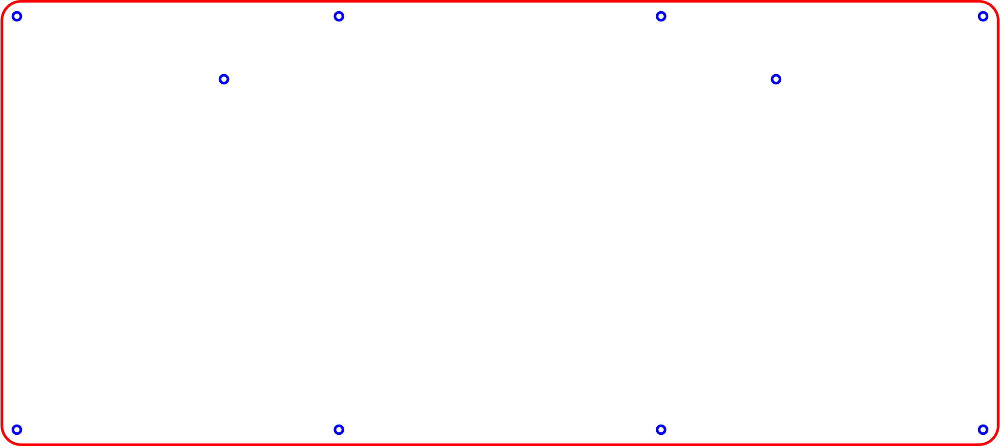
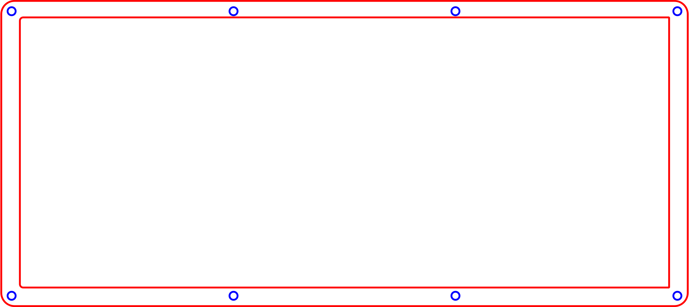
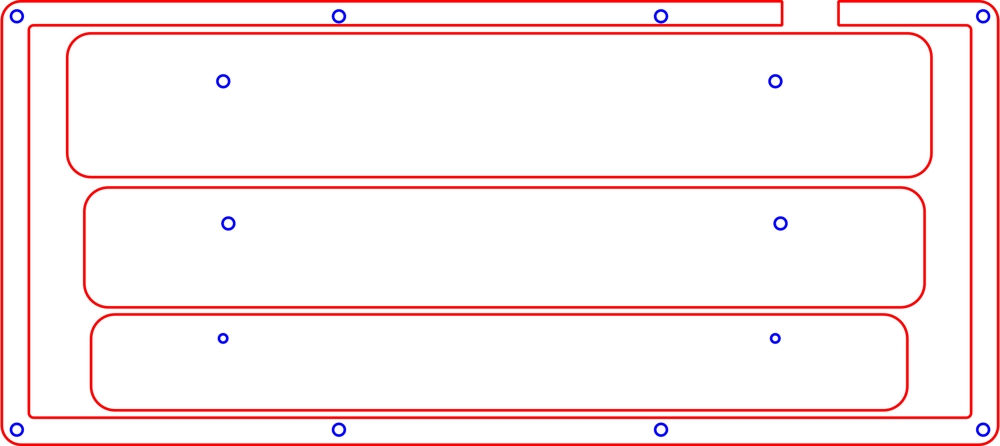
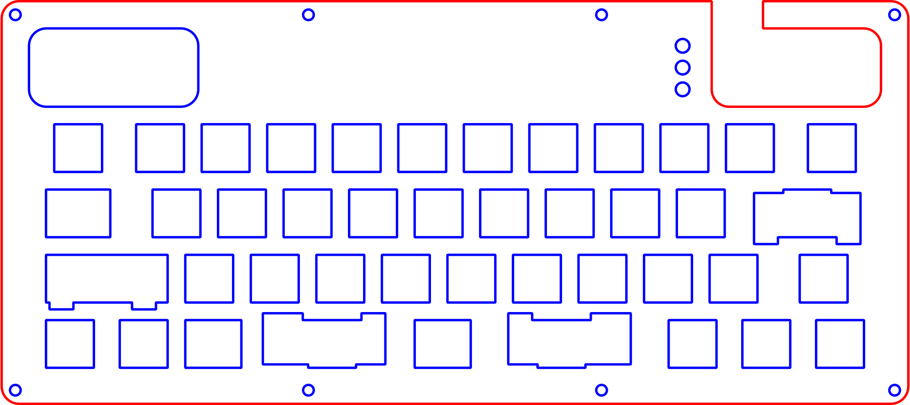
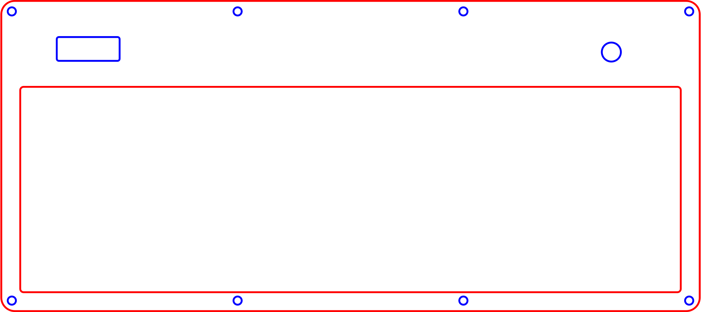
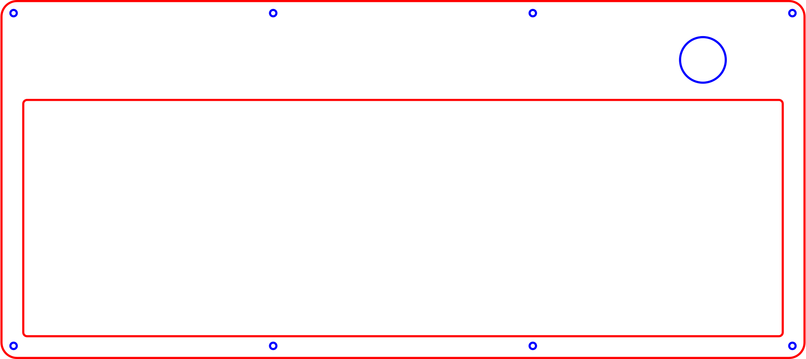

# Squash Keyboard Hardware

Small keyboard for big brains with lots of layers
🤏 ⌨️ 🧠 🍰

This keyboard uses an acyrlic case, POM switchplate, and PCB mounted switches and stabilizers.

See Squash's bigger brother for [build instructions](https://github.com/KoBussLLC/grabert-hardware/blob/main/doc/BUILDGUIDE.md) and [additional information](https://github.com/KoBussLLC/grabert-hardware/blob/main/README.md).

## PCB

This project uses KiCad for electrical CAD

### Electrical Design Constraings
- No diode matrix enabled by LQFP 100 Footprint
- STM32 Based Microcontroller
- USB-C
- PWM LED indicators for Caps Lock and modifiers
- PCB Mount switches
- Enocder and I2C OLED Display

## CAD

This project uses FreeCAD 0.19 for mechanical CAD. File names are prefixed with a unique, arbitrary alphanumeric code with the first character always being a alpha character.

### Required Addons
- Assembly 4
- fasteners
- kicadStepUpMod

### Mechanical Design Contraints
- 40% Keyboard Layout
- Split spacebar and left shift layout options
- Push Button Encoder
- OLED Screen
- Fully Laser Cut Case

### Acrylic Sheet Stackup

Main Case Stackup. 0 is the bottom of the case. Foot pieces are included in the D65_USBCutoutSpacer.svg file and are assembled with the smallest piece on the bottom.

| Sheet Number | FreeCAD File Name | Thickness | Material | Shape |
| - | - | - | - | - |
| 0 | O56_BottomPlate | 0.125 in | Acrylic |  |
| 1 | Y7X_ClosedSpacer | 0.125 in | Acrylic |  |
| 2 | D65_USBCutoutSpacer | 0.125 in | Acrylic |  *includes foot pieces |
| 3 | D65_USBCutoutSpacer | 0.125 in | Acrylic |  *includes foot pieces |
| 4 | S86_SwitchPlate | 0.0625 in | POM/Acetal |  |
| 5 | Y7X_ClosedSpacer | 0.125 in | Acrylic |  |
| 6 | Q45_OLEDCover | 0.125 in | Acrylic |  |
| 7 | O03_TopCover | 0.125 in | Acrylic |  |
